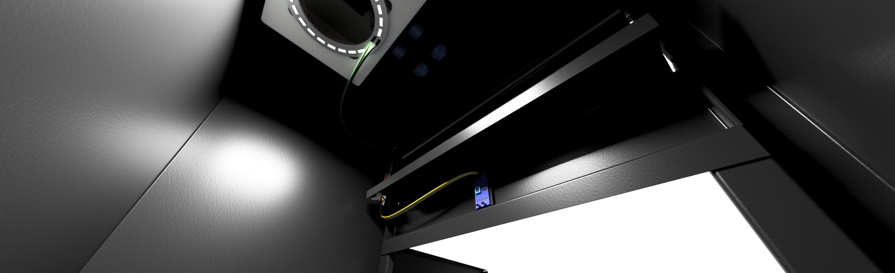
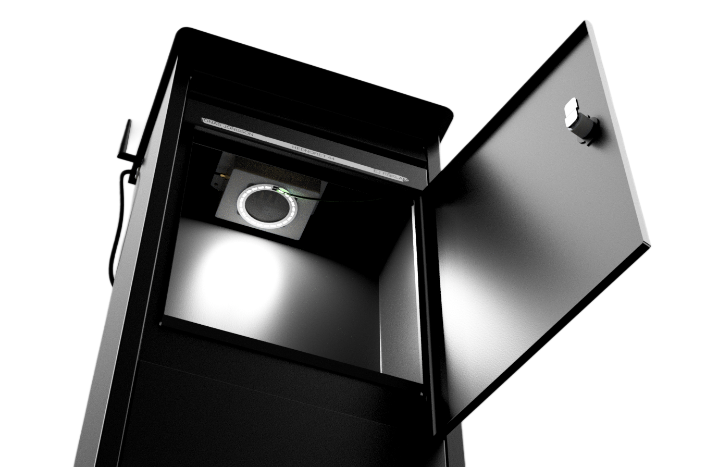
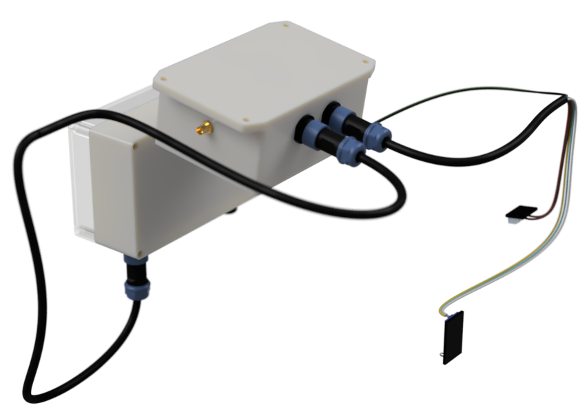
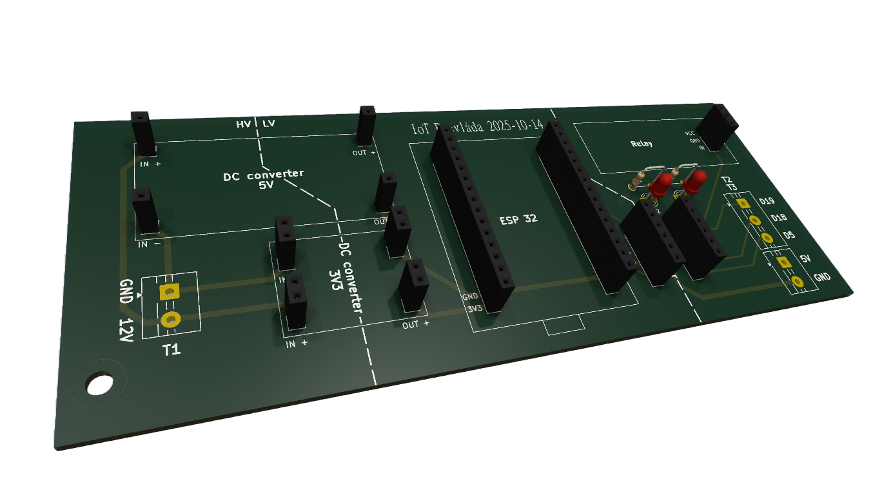
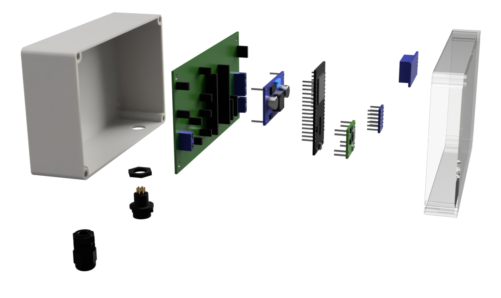
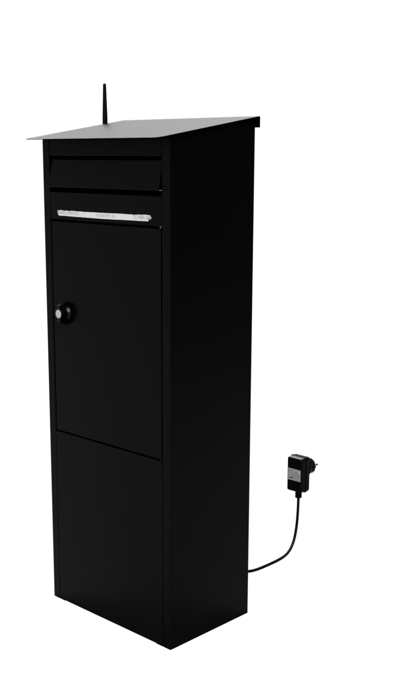
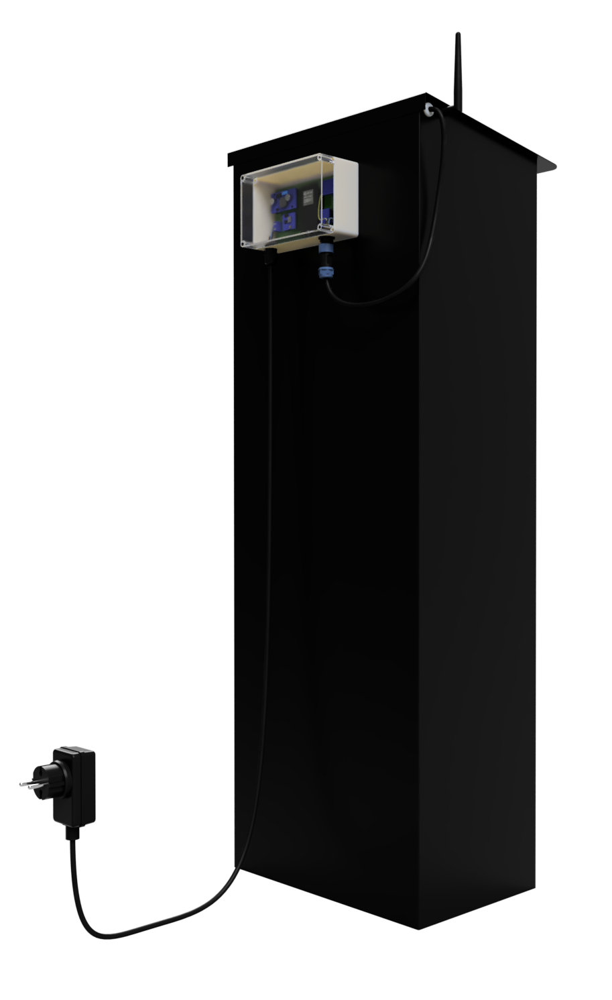

# 📬 Smart Mailbox (ESP32 + ESP32-CAM)

A microcontroller-based smart mailbox that detects mail delivery and captures images locally using sensors and an ESP32-CAM.

---

## 📸 Final Prototype

<p align="center">
  
</p>

The complete system integrated into a standard outdoor mailbox.
All electronics, sensors and camera modules are mounted internally and adapted for outdoor operation.

---

## 💡 System in Operation

<p align="center">
  
</p>

When a delivery is detected, internal lighting is activated and an image is captured automatically.

---

## 🧠 System Overview

<p align="center">
  
</p>

This view shows the internal system layout without the mailbox enclosure.

### Main components:

* ESP32 (main controller)
* ESP32-CAM (camera module)
* IR sensor (mail detection)
* Microswitch (door detection)
* LED lighting system
* Relay and power electronics

---

## ⚙️ How It Works

1. The mailbox door opens → detected by microswitch
2. Mail passes into the box → detected by IR sensor
3. ESP32 validates the event
4. LED lighting turns on
5. ESP32-CAM captures an image
6. Image is displayed via local web interface

The combination of sensors improves detection reliability compared to using a single sensor.

---

## 🔌 Electronics & PCB

<p align="center">
  
</p>

A custom-designed PCB is used to:

* simplify wiring
* improve system reliability
* integrate power distribution and signal routing

---

## 📦 Enclosures (Kapslingar)

### Main enclosure

<p align="center">
  
</p>

Contains:

* ESP32
* power electronics
* relay module

---

### Secondary enclosure

<p align="center">
  
</p>

Contains:

* ESP32-CAM
* camera module
* lighting system

---

## 🏗️ Physical Installation

<p align="center">
  
  
</p>

The system is mounted directly inside the mailbox with carefully planned placement of sensors, camera and electronics.

---

## 🧩 Hardware Design Considerations

* Dual-sensor detection increases robustness
* Components are physically separated to reduce interference
* Electronics are protected using sealed enclosures
* Custom PCB reduces wiring complexity
* Lighting is required due to low internal brightness

---

## 📂 Project Structure

```
.
├── esp32-main/
│   └── src/
│
├── esp32-cam/
│   └── src/
│
├── schematics/
│
├── images/
│   ├── brevlada_tot_v5.png
│   ├── system_naket.png
│   ├── pcb_3d.png
│   ├── huvudlada_sprangd.png
│   ├── sekundarlada_sprangd.png
│   ├── framifran.png
│   ├── bakifran.png
│   └── lampa_aktiv.png
│
└── README.md
```

---

## 🚀 Setup

1. Flash code to:

   * ESP32 (main unit)
   * ESP32-CAM

2. Configure:

   * WiFi credentials
   * IP address for camera

3. Power the system using external supply

4. Access the system via local web interface

---

## 🔮 Future Improvements

* Improved timing between sensors and image capture
* Notification system (mobile / email)
* Higher image resolution
* Battery-powered operation

---

## 📄 Project Context

This project was developed as part of a Swedish upper secondary engineering project, focusing on:

* Embedded systems
* Sensor integration
* Wireless communication

---

## 👤 Author

[Your Name]
